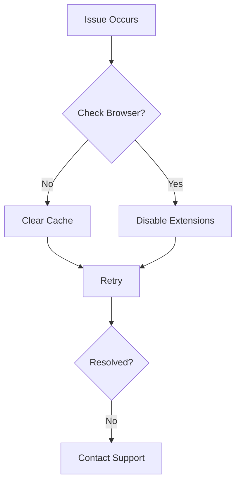

## Account Management

Manage your account settings to access all features of Danielle Evans Documentation. Use these expandable sections to find quick answers.

<ExpandableGroup>

<Expandable title="How do I reset my password?" default-open="true">

Follow these steps to reset your password securely.

<Steps>
  <Step title="Navigate to Login" icon="log-in">
    Go to the login page and click `Forgot Password?`.
  </Step>
  <Step title="Enter Email" icon="mail">
    Provide your registered email address.
  </Step>
  <Step title="Check Inbox" icon="inbox">
    Open the email from Danielle Evans Documentation and click the reset link.
  </Step>
  <Step title="Set New Password" icon="lock">
    Enter a strong password meeting these requirements: 12+ characters, mix of letters, numbers, and symbols.
  </Step>
</Steps>

<Callout kind="tip">
  Enable two-factor authentication after resetting for added security.
</Callout>

</Expandable>

<Expandable title="What if I can't access my account?">

Contact support at `support@danielleevans.com` with your account email. Provide details like last login date and recent activity.

</Expandable>

</ExpandableGroup>

## Troubleshooting Basics

Resolve common issues quickly. Start with basic checks before advanced steps.

<Tabs>
  <Tab title="Browser Issues" icon="globe">
    
    Clear your browser cache and cookies.
    
    <CodeGroup tabs="Chrome,Firefox">
    ````bash
    # Chrome: chrome://settings/clearBrowserData
    Select "All time" and clear.
    ````
    ````bash
    # Firefox: about:preferences#privacy
    Click "Clear Data".
    ````
    </CodeGroup>
  </Tab>
  <Tab title="Network Errors" icon="wifi-off">
    
    Verify your internet connection and disable VPN if active.
    
    Test with `ping docs.danielleevans.com`.
  </Tab>
</Tabs>



## Best Practices

Follow these guidelines to optimize your documentation workflow.

<Columns cols={2}>
  <Card title="Version Control" icon="git-branch" href="#">
    Integrate with GitHub for seamless updates.
  </Card>
  <Card title="Markdown Tips" icon="edit-3" href="#">
    Use consistent headings and lists for readability.
  </Card>
</Columns>

<Callout kind="info">
  Always preview changes before publishing to avoid broken links.
</Callout>

### Writing Effective Docs

Organize content with clear hierarchy.

| Best Practice | Why It Matters | Example |
|---------------|----------------|---------|
| Use H2 for sections | Improves navigation | `## Overview` |
| Add code blocks | Enhances clarity | ````markdown ```javascript const apiKey = process.env.API_KEY; ```` |
| Include components | Boosts engagement | `<Callout>`, `<Steps>` |

<Expandable title="Advanced MDX Tips" default-open="false">

Escape special characters like `{variable}` or `<100ms` in prose using backticks.

For multi-language support:

<CodeGroup tabs="JavaScript,Python">
```javascript
// Fetch docs data
const response = await fetch('/api/docs', {
  headers: { Authorization: `Bearer ${token}` }
});
```
```python
# Fetch docs data
import requests
response = requests.get('/api/docs', headers={'Authorization': f'Bearer {token}'})
```
</CodeGroup>

</Expandable>