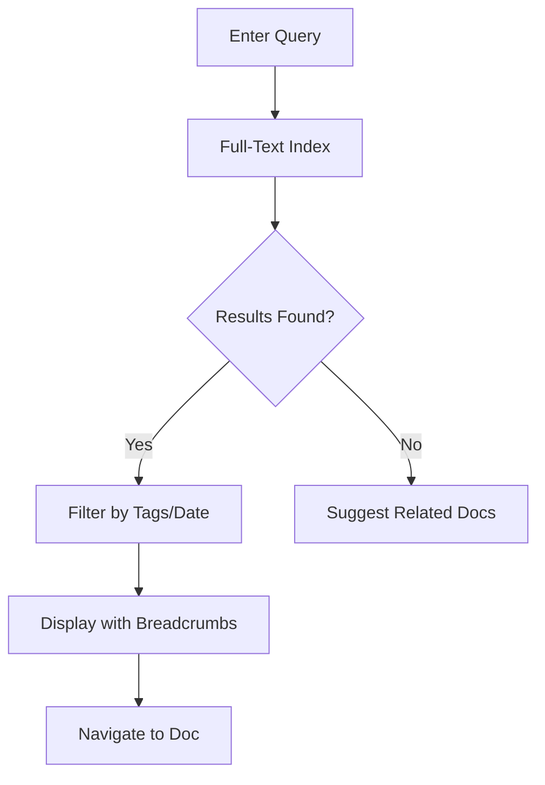

## Overview

Danielle Evans Documentation provides powerful tools to streamline your documentation workflows. You organize content efficiently, collaborate with your team in real time, and find information quickly through advanced search and intuitive navigation. These core features ensure your project documentation stays accessible and up-to-date.

<Columns cols={3}>
  <Card title="Document Organization" icon="folder" href="#document-organization">
    Structure your docs with folders, tags, and versioning for easy management.
  </Card>
  <Card title="Collaboration Tools" icon="users" href="#collaboration-tools">
    Enable team editing, comments, and notifications to work together seamlessly.
  </Card>
  <Card title="Search and Navigation" icon="search" href="#search-navigation">
    Discover content instantly with full-text search and smart breadcrumbs.
  </Card>
</Columns>

## Document Organization

You create hierarchical structures to keep your documentation tidy. Use folders for top-level categories and tags for cross-referencing.

<Steps>
  <Step title="Create Folders" icon="folder-plus">
    Navigate to your workspace and select **New Folder**. Name it based on your project phase, such as `API Reference`.
  </Step>
  <Step title="Add Tags" icon="tag">
    Open a document, click **Tags**, and add labels like `v2.0` or `internal`.
  </Step>
  <Step title="Version Control" icon="git-branch">
    Enable versioning to track changes. Publish updates without losing history.
  </Step>
</Steps>

<Callout kind="tip">
  Combine folders and tags for hybrid organization. This approach scales as your documentation grows.
</Callout>

## Collaboration Tools

Your team collaborates without friction. Real-time editing, inline comments, and role-based permissions keep everyone aligned.

<Tabs>
  <Tab title="Real-Time Editing" icon="edit-3">
    Multiple users edit simultaneously. Changes appear instantly, with cursors showing who edits what.

    <CodeGroup tabs="JavaScript,Python">
      ```javascript
      // Integrate real-time updates
      import { RealtimeDoc } from '@danielleevans/docs-sdk';
      const doc = new RealtimeDoc('project-guide');
      doc.on('update', (changes) => console.log(changes));
      ```
      ```python
      # Integrate real-time updates
      from danielleevans.docs import RealtimeDoc
      doc = RealtimeDoc('project-guide')
      doc.on_update(lambda changes: print(changes))
      ```
    </CodeGroup>
  </Tab>
  <Tab title="Comments & Notifications" icon="message-circle">
    Add comments to specific sections. @mention teammates for reviews and get email/slack notifications.
  </Tab>
</Tabs>

## Search and Navigation

Find exactly what you need with powerful search. Use filters for tags, authors, or dates, and navigate via breadcrumbs or sitemaps.

| Search Type | Description | Example Query |
|-------------|-------------|---------------|
| Full-Text | Matches words across all docs | `authentication flow` |
| Tag-Based | Filters by labels | `tag:v2.0` |
| Advanced | Date range + author | `after:2024-01-01 author:alice` |



<Expandable title="Advanced Search API" default-open="false">
  Integrate search into your apps.

  <Request tabs="cURL,JavaScript">
    ```bash
    curl "https://api.danielleevans.com/search?q=authentication&tags=v2.0" \
      -H "Authorization: Bearer {API_TOKEN}"
    ```
    ```javascript
    const results = await fetch('https://api.danielleevans.com/search?q=authentication&tags=v2.0', {
      headers: { Authorization: `Bearer ${API_TOKEN}` }
    });
    ```
  </Request>

  <Response>
    ```json
    {
      "results": [
        { "title": "Auth Guide", "url": "/docs/auth", "score": 0.95 }
      ],
      "total": 12
    }
    ```
  </Response>
</Expandable>