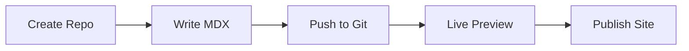

## Platform Overview

Danielle Evans Documentation provides a centralized space to create, organize, and publish your project documentation. You build docs using Markdown and MDX, with live previews and version control integration. The platform emphasizes simplicity, enabling teams to collaborate without complex setups.

<Columns cols={3}>
  <Card title="Markdown & MDX Support" icon="edit-3" href="/docs/markdown">
    Write in familiar Markdown syntax with powerful MDX components for interactive docs.
  </Card>
  <Card title="Real-Time Collaboration" icon="users" href="/docs/collaboration">
    Edit docs together with others, track changes, and resolve conflicts seamlessly.
  </Card>
  <Card title="Version Control" icon="git-branch" href="/docs/versions">
    Connect to GitHub or GitLab for automatic builds and deployments on every push.
  </Card>
</Columns>

## Key Benefits

You gain speed and efficiency with these core advantages:

<Callout kind="tip">
  Start small and scale. Begin with a single Markdown file and grow into a full documentation site.
</Callout>

| Benefit              | Description                                                                 |
|----------------------|-----------------------------------------------------------------------------|
| Simplicity           | No steep learning curve—use standard Markdown you already know.             |
| Collaboration        | Invite team members to edit, comment, and approve changes in real time.     |
| Customizable Themes  | Apply your brand with custom CSS and the primary color `#3B82F6`.           |
| Search & Navigation  | Built-in full-text search and automatic sidebar generation.                 |
| Export Options       | Publish as static sites, PDFs, or embed in your app.                        |

<Tabs>
  <Tab title="For Developers" icon="code">
    Integrate with your workflow using Git. Push changes and see live previews instantly.
  </Tab>
  <Tab title="For Managers" icon="users">
    Assign roles, track documentation coverage, and generate reports on completion.
  </Tab>
  <Tab title="For Designers" icon="monitor">
    Preview responsive designs with dark mode and custom themes applied live.
  </Tab>
</Tabs>

## Getting Oriented

Follow these steps to set up your first documentation space.

<Steps>
  <Step title="Create Your Space" icon="plus">
    Sign up at `danielleevans.com/docs` and create a new documentation project.
  </Step>
  <Step title="Connect Repository" icon="git-branch">
    Link your GitHub repo. The platform clones it and sets up continuous deployment.
  </Step>
  <Step title="Add Your First Doc" icon="edit-3">
    Create `introduction.mdx` in your repo root.

    <CodeGroup tabs="MDX,Bash">
```mdx
---
title: My Project
description: Overview of features.
---

## Welcome

Your content starts here.
```
```bash
git add introduction.mdx
git commit -m "Add intro doc"
git push origin main
```
    </CodeGroup>
  </Step>
  <Step title="Preview & Publish" icon="eye">
    View live preview at your custom URL. Publish with one click.
  </Step>
</Steps>

<Expandable title="Common Next Steps" default-open="false">

Explore these resources to dive deeper:

- [Customize themes](/docs/themes)
- [Add search](/docs/search)
- [Team permissions](/docs/permissions)

</Expandable>



Your documentation site deploys in under 60 seconds after each push, ready for sharing with your team.